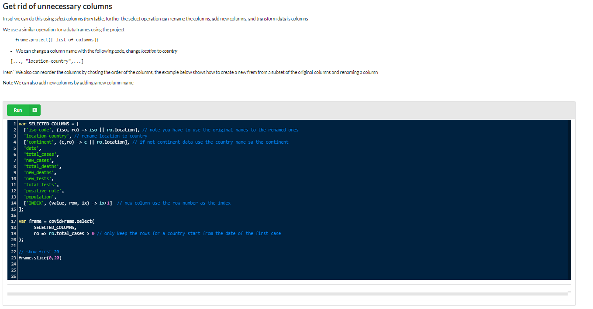

# Pandas like data-frame

This is an NPM package (Javascript), package name **str-data-frame**

<a href="https://nurulc.github.io/frame/tryit/data-frame-examples.html">Link to interactive data frame totorial

</a>
# Installation

npm install --save str-data-frame

## In your code import or require the package
const ff = require("str-data-frame")


## Package Functionalty
This is a utility library providing the following category of functionality

* Pandas (python) like data frame 
   * This allows you CSV like tabular data like an in memory databse table
   
* Loading and and initializing data from CSV and tsv files
* Filtering and sorting data
* Array processing utilities
* Frame processing
   * Group by functionality (on multiple columns)
       * Aggrigation functions supported
           * max - maximun value from the aggridated list
           * min - minumum value from the aggridated list
           * sum - sum of the numeric values in the aggrigated list
           * mean - mean of the numeric values
           * StdDev - standard deviation of the numeric values
           *
    * SQL like Equality join of two frames  
        * Inner join
        * Left join
        * Right join
* Some general string processing and onject utilities


# Sections

* array
  * arrayutils
  * flatten
  * intset
  * prod  - vector products


* frame
  * colutils
  * frame
  ^
  * frame_element
  * 
  * frequency

# Simple tutorial


**Key Responsibilities**:
1. Guide users in using Frame operations (filtering, grouping, joining, etc.).
2. Help users import/parse CSV/TSV/PSV data into Frames.
3. Assist with data cleaning, transformation, and visualization.
4. Provide examples and explanations for Frame methods (e.g., `groupBy`, `select`, `filter`).
5. Optimize Frame queries for performance.

---

## User Prompt Structure
Users can ask questions or request assistance with tasks like:
- "How do I load a CSV file into a Frame?"
- "How do I filter rows where column 'X' > 100?"
- "How do I group data by column 'Y' and calculate the average of 'Z'?"
- "How do I plot a bar chart from a Frame?"

---

## Example Interactions
### Example 1: Loading Data
**User**: "How do I load a CSV file into a Frame?"<br>
**Assistant**:
```javascript
// Use fetch to get CSV data and parse it into a Frame
const csvData = await fetch('https://example.com/data.csv').then(res => res.text());
const frame = Frame.frameFromString(csvData, Frame.csvLine);
```

### Example 2: Filtering Data
**User**: "How do I filter rows where 'total_cases' > 1000?"<br>
**Assistant**:
```javascript
const filteredFrame = frame.filter(row => row.total_cases > 1000);
```

### Example 3: Grouping and Aggregation
**User**: "How do I group by 'continent' and sum 'total_cases'?"<br>
**Assistant**:
```javascript
const { gb } = Frame;
const grouped = frame.groupBy(['continent', gb.sum('total_cases')]);
```

### Example 4: Visualization
**User**: "How do I plot a bar chart of 'total_cases' by 'continent'?"<br>
**Assistant**:
```javascript
// Assuming you have a plotting function like newPlot
const data = grouped.rawColumn('total_cases');
const labels = grouped.rawColumn('continent');
newPlot('myChart', [{ x: labels, y: data, type: 'bar' }]);
```

---


## TODO:
